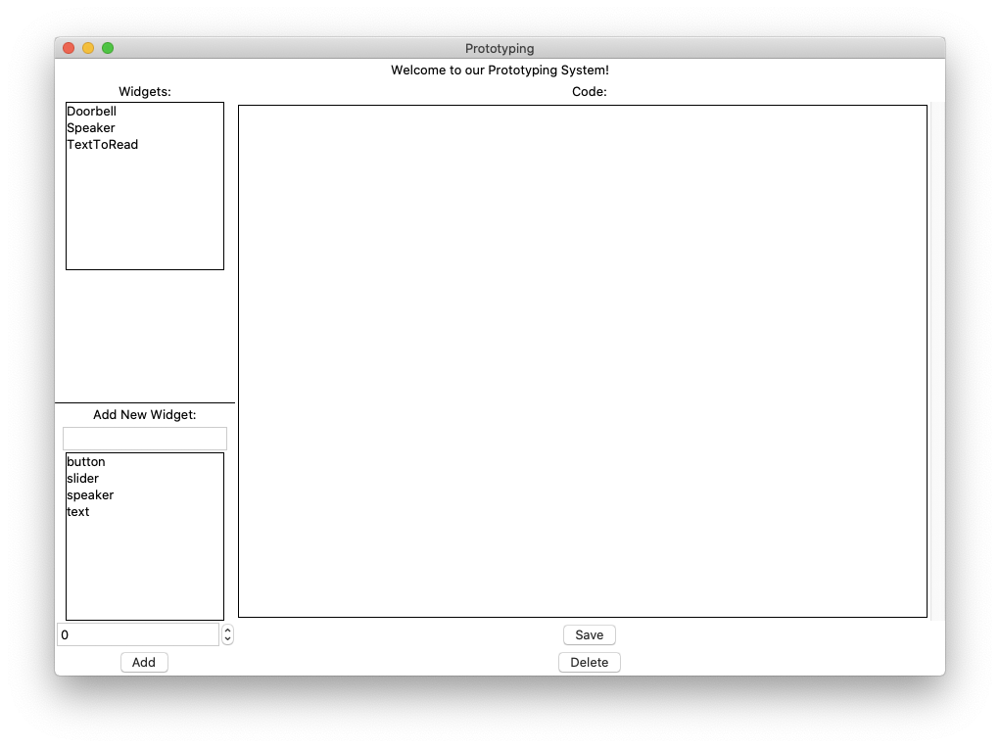
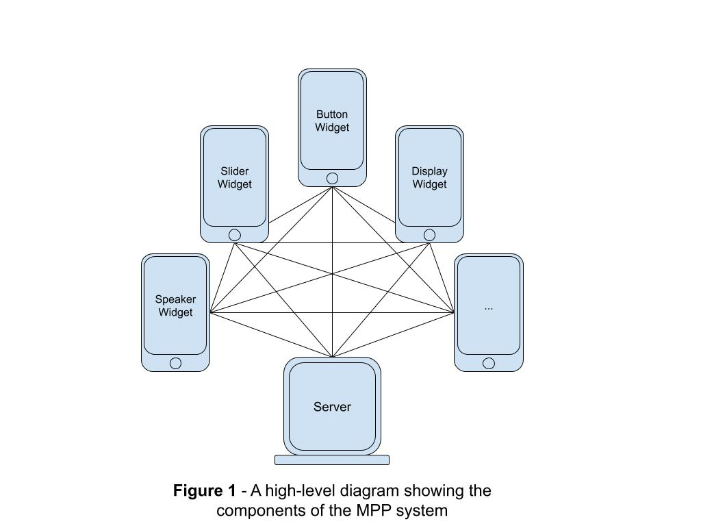
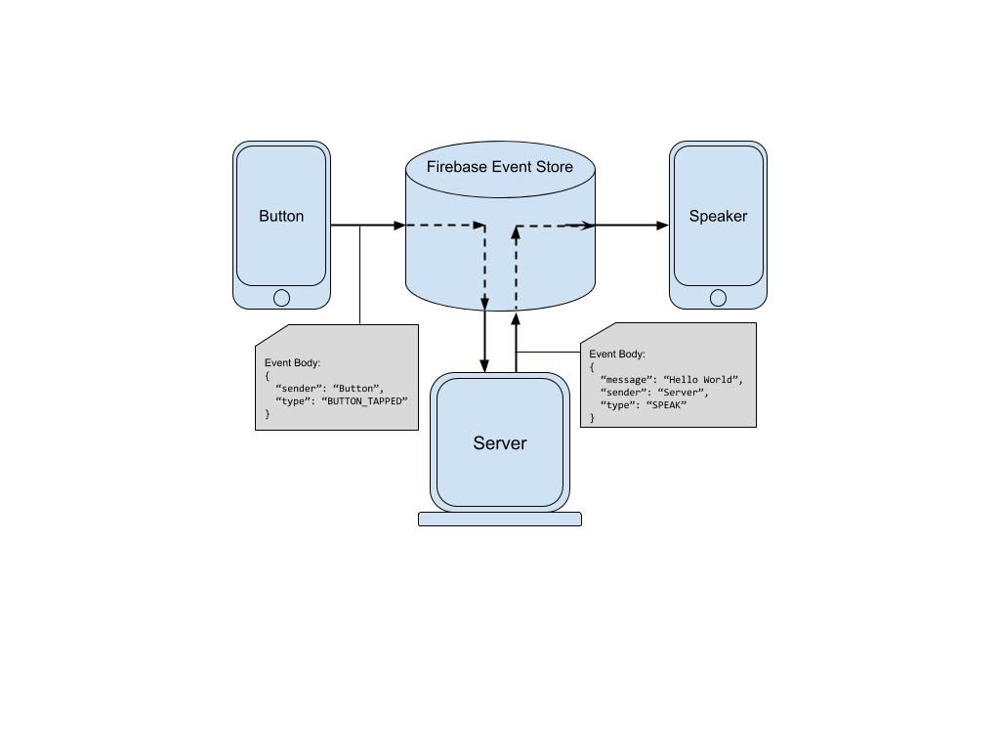

# prototyping-server

## How to run the server

The server is written python, and uses a virtual environment to reduce the
necessary requirements on the host machine. You will only need to have 
`pipenv` to run the server. Once you have `pipenv` installed, run
```
pipenv install
```
in the root of the project to download all the python dependencies necessary.

In order to launch the server and GUI, simply execute the following command:
```
pipenv run python server.py
```

If all goes well, you should see a window that looks similar to this:


For details about how to use the GUI, see the [usage section](#usage).

## System Overview

This repository contains code necessary to run the server in the prototyping 
system. See the diagram below for a high level overview of the system.



In this system, widgets can talk any other widget. However, in order to keep the
clients as slim as possible, the logic of who to communicate with and what to 
send is all contained in the server. See diagram below of a "zoomed in" 
communication example.



This diagram is crucial in understanding the implementation of the system as a
whole. Imagine if every widget were to communicate with every other widget
individually. This would require each widget to have to "scan" for other 
widgets in the system, and for the server to update the executing code of
every widget in the system whenever the system designer updates the  

## Firebase

## Server Codebase

## Usage

See this quick demo about typical usage:


### Widgets Section

This section shows a selectable box of all the widgets that are currently 
registered from the server-side. Note that this does *not* display all 
widgets that are registered in firebase. The two should stay in sync, but
if you manually create a widget in firebase (rather than through the server)
it will not be displayed in this list.

If you click on a widget within this box, the GUI will load the attributes for
the selected widget. You will notice property attributes beneath the widget 
select box, as well as the code in the large text area. Here are descriptions
and details about each of the attributes that are loaded (top -> bottom, left -> right):

1. **Widget Type**: This field displays the widget type that was selected when 
it was created. This type is used by the widget to determine what UI should be 
displayed on the phone screen.
2. **Photo Identifier**: This field displays the ID of the photo that will be
displayed on the widget, and will also be used by the AR app to identify the 
widget that is being scanned.
3. **Widget Code**: This field contains the code that is executed when the widget
sends an event to the server. For instance, if a *Button* widget is clicked, it
will send an event to the server that will execute the `button_tapped` function
in that widget's code. For more details, see the [widget code](#widget-code-details) 
section.

### Add New Widget Section

This section allow you to add a new widget to the system. There are three attributes
that you select before creating a new widget. Here are the descriptions about each
of those fields:

1. **Widget Name**: This will be the name that the widget will be associated with in all three applications. It will be used in all of the following scenarios:
  1. Test
2. **Widget Type**: This type is used by the Android app to determine what UI should
be displayed on the phone screen.

## Widget Code Details