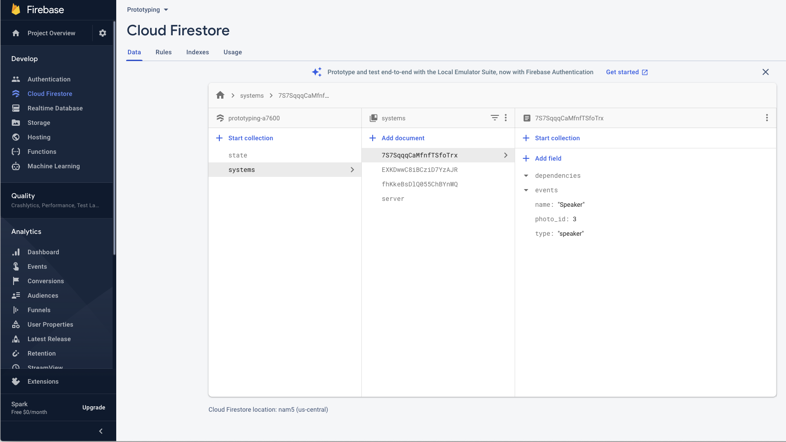

# prototyping-server

## Setup

The server is written python, and uses a virtual environment to reduce the
necessary requirements on the host machine. You will only need to have `python`
(version `3.8.2` is currently defined in the `Pipfile`, but if you don't have
that version, you can probably change it to something else and it should still
work) and `pipenv` (install via `python -m pip install pipenv`) to run the 
server. Once you have `pipenv` installed, run:
```
pipenv install
```
in the root of the project to download all the necessary python dependencies.

There is also a git ignored secrets file that allows the code to interact
with [Firebase](#firebase-firestore). This file is named `service_account.json`, and can
be obtained by reaching out to one of the project admins. If the key is lost,
a new one can be generated from the [firebase console](https://console.firebase.google.com/u/0/project/prototyping-a7600/settings/serviceaccounts/adminsdk).
If you aren't able to view the project, please reach out to Eric Romrell or 
Mike Jones, who should be able to add you as a member 
[here](https://console.firebase.google.com/u/0/project/prototyping-a7600/settings/iam).

## Running the server

For any communication to happen in the system, the server must be running.

To launch the server with it's GUI, simply execute the following command:
```
pipenv run python server.py
```

If all goes well, you should see a window that looks similar to this:


For details about how to use the GUI, see the [usage section](#usage).

## System Overview

This repository contains code necessary to run the server in the prototyping 
system. See the diagram below for a high level overview of the system.


In this system, widgets can talk any other widget. However, in order to keep the
clients as slim as possible, the logic of who to communicate with and what to 
send is all contained in the server. See diagram below of a "zoomed in" 
communication example.


This diagram is crucial in understanding the implementation of the system as a
whole. Imagine if every widget were to communicate with every other widget
individually. This would require each widget to have to "scan" for other 
widgets in the system, and for the server to update the executing code of
every widget in the system whenever the system designer updates the code from
the server GUI. This solution causes lag and reliability issues. For this reason,
this project implements all communication in a server-centric model. The Android
widgets do not need to interact with other widgets directly. In fact, they don't
even need to interact directly with the server itself! Instead, all communication
is done using asynchronous events sent through [Firebase](#firebase-firestore). 

When *Button* "talks" to *Speaker* in the example above, what really occurs 
under the hood is that the Android app registered to the *Button* widget modifies
the document associated with server, telling it that the button was tapped. The
server is then listening for changes to it's document, and when it notices that
*Button* sent a button tap event, it will run the local code file associated with
*Button*, calling the `button_tapped` function. In the case shown above, we see
that the function is telling *Speaker* to say something. That is done by modifying
the document associated with *Speaker*, telling it to say something. Then the Android
device registered to the *Speaker* widget (which is listening to changes to the 
*Speaker* document), will process the event and read out the requested message.

This architecture allows for widgets (and even the server) to go offline, and when
it comes back online, it will process whatever events are in it's queue. This
makes the system highly reliable, especially when dealing with old hardware or 
spotty network connections.

## Firebase Firestore

Firebase is a cloud platform developed by Google. Firebase has many many components,
but the one that we use is called Firestore. Firestore is a real-time 
collection/document database that allows clients to register as a listener to changes
to a collection/document.



You'll see in the screenshot above that Firestore is divided into collections of 
documents. In our implementation, we have created the following collections:

* **systems**: This collection contains a document for each widget (referenced by
it's widget ID), and one document for the server. Each of these system document
follows a similar structure, with the following elements:
    * **type**: The type of the system (e.g. `button`, `speaker`, or `server`)
    * **name**: The name of the widget. Used in the server GUI, Android app, and
    AR app. Does not exist for the server.
    * **photo_id**: The ID of the photo that is displayed on the widget.
    * **events**: An array containing the queue of events. Each event will follow
    this structure:
        * **sender**: The id of the system sending the event
        * **type**: The type of the event being sent. (e.g. `UPDATE_TEXT`, 
        `BUTTON_TAPPED`, etc). The event type is also used as the name of the 
        function executed on the server for an event raised by a widget.
        * **message**: Any additional data needing to be sent. (e.g. the text 
        to speak in a `SPEAK` event, or the new text in a `TEXT_UPDATED` event)
    * **dependencies**: An array of strings containing the ID of widgets that
    this widget's code is referencing. This field is used by the AR app to draw
    the dependency animations.
* **state**: This collection contains a single document with the state. This 
document is just a key-value pair document that the system designer can use to 
store information (e.g. when a `PROGRESS_UPDATED` event is raised, the 
`new_progress` field could be saved in the `state` for later use)
* **event_flows**: This collection contains documents that track widget-to-widget
interactions. For instance, if a button *widget1* is tapped, and the server code
for that button says to make a slider update it's progress, that would create a 
single *event_flow* document, even though there were 2 events raised (widget1 -> 
server, server -> widget2). However, a single action *can* create multiple event
flows (e.g. if the code for that button also had a speaker widget say something,
in addition to update a slider's progress). Here is the schema of an 
*event_flow* document:
    * **timestamp**: Current time in seconds since epoch
    * **sender**: ID of the sending widget
    * **receiver**: ID of the receiving widget

## Server Codebase

The purpose of the server is two fold:
1. Present a usable UI to design and manage the system.
2. Listener for incoming server events, determine the correct code to execute,
and raise any subsequent events.

You'll notice that all of the UI components are contained in the `gui.py` file.

The `server.py` file is in charge of launching the UI and then subscribing as a 
listener to the `server` firebase document, in order to consume events as they
enter the queue.

When an event enters the queue, the server uses the event's *sender* attribute
to determine what file to load, and uses the event's *type* attribute to determine
what function to call within that loaded module. The server also uses 
`SimpleNamespace` to pass in more usable objects into the module's function. See
[code details](#widget-code-details) for more details about the code implementation.

The server also is used to analyze widget code to determine potential dependencies
that are displayed by the AR app. This is simple text analysis that happens 
whenever a widget's code is updated.

## Usage

See this quick demo about typical usage:


### Widgets Section

This section shows a selectable box of all the widgets that are currently 
registered from the server-side. Note that this does *not* display all 
widgets that are registered in firebase. The two should stay in sync, but
if you manually create a widget in firebase (rather than through the server)
it will not be displayed in this list.

If you click on a widget within this box, the GUI will load the attributes for
the selected widget. You will notice property attributes beneath the widget 
select box, as well as the code in the large text area. Here are descriptions
and details about each of the attributes that are loaded (top -> bottom, left -> right):

1. **Widget Type**: This field displays the widget type that was selected when 
it was created. This type is used by the widget to determine what UI should be 
displayed on the phone screen.
2. **Photo Identifier**: This field displays the ID of the photo that will be
displayed on the Android app, and will also be used by the AR app to identify the 
widget that is being scanned.
3. **Widget Code**: This field contains the code that is executed when the widget
sends an event to the server. For instance, if a *Button* widget is clicked, it
will send an event to the server that will execute the `button_tapped` function
in that widget's code. For more details, see the [widget code](#widget-code-details) 
section. This code is saved to a local file `widgets/<widget_id.py` which will
be executed the next time that widget pushes an event.

### Add New Widget Section

This section allow you to add a new widget to the system. There are three attributes
that you select before creating a new widget. Here are the descriptions about each
of those fields:

1. **Widget Name**: This will be the name that the widget will be associated with in 
all three applications. It will be used in all of the following scenarios:
    * The widgets selection box of the server GUI
    * The widget's code on the server (e.g. `widgets.widget_name.speak(...)`). For more
details, see the [widget code](#widget-code-details) section
    * The Android app's drop-down list to select a widget to display
    * The AR app's banner after scanning a widget
2. **Widget Type**: This type is used by the Android app to determine what UI should
be displayed on the phone screen. It will also be used to create a template for the
code that includes the functions that a widget of that type typically uses.
3. **Photo ID**: This ID will be used to determine the photo that will be
displayed on the Android app, and will also be used by the AR app to identify the 
widget that is being scanned.

### Modification Buttons

At the bottom of the GUI, there are two buttons
1. **Save**: This button will send attribute changes to firebase (such as the widget
type or photo ID), as well as overwriting the local file containing the widget's code.
2. **Delete**: This button will delete the widget from firebase, as well as deleting
the local file containing the widget's code.

## Widget Code Details

TODO